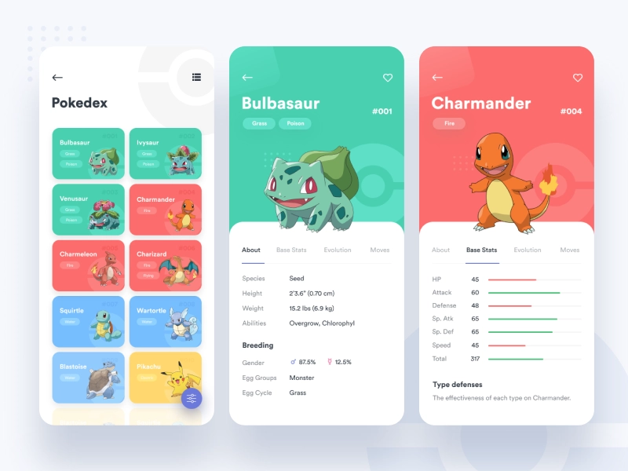

# Prueba técnica: React Poke Pinterest

Armar una grilla estilo *Pinterest* para mostrar los pokemones. Y luego al hacer click en uno ampliarlo a pantalla completa y mostrar más información.

**NOTA:** El diseño es a modo de inspiración, no tiene que ser igual, pero tiene que ser lindo.

### UTILIDADES

* API: https://pokeapi.co/

## Versión 2

Utilizar context y armar una cabecera de Pinterest con un pokemon destacado. "El Pokemon del mes" que puede ser aleatorio, pero también esta en la grilla de abajo (es decir, la info está repetida, por eso el context).